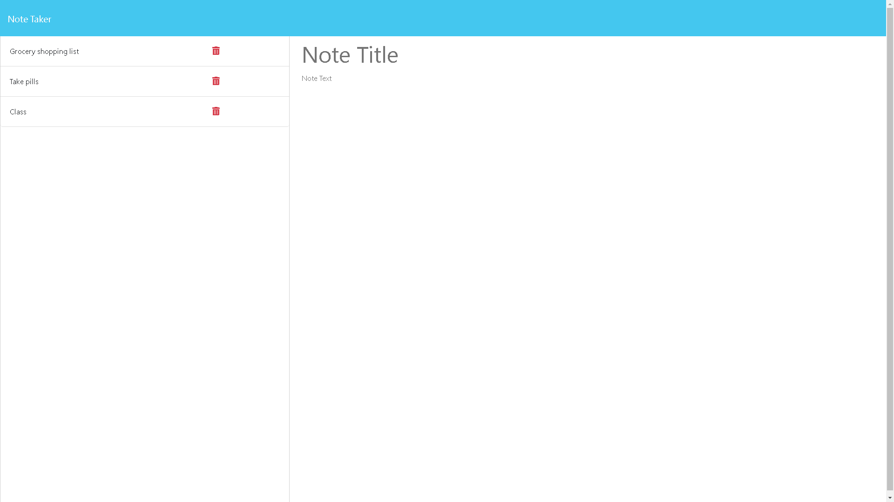

# Module 11 Express.js Challenge   
Note Taker
## Description
 This project is an application called Note Taker that can be used to write and save notes. This application will use an Express.js back end and will save and retrieve note data from a JSON file.

  ## Table of Contents 
  - [Installation](#installation)
- [Usage Information](#usage-information)
- [License](#license)
- [Questions](#questions)
## Installation
1. Clone the git repository
2. Open a terminal in the develop folder
3. Run the command 'npm i'
4. Run the command 'node server.js'
## Usage Information 

Test a live version of the app here: https://young-stream-42863-8bb79629a13a.herokuapp.com
## License 
This project is covered under the MIT license.   https://opensource.org/licenses/MIT

  ## Questions
  
  For additional questions send an email to: Dasantia89@yahoo.com  
  Send a message on github here: http://www.github.com/dasantia89
    
